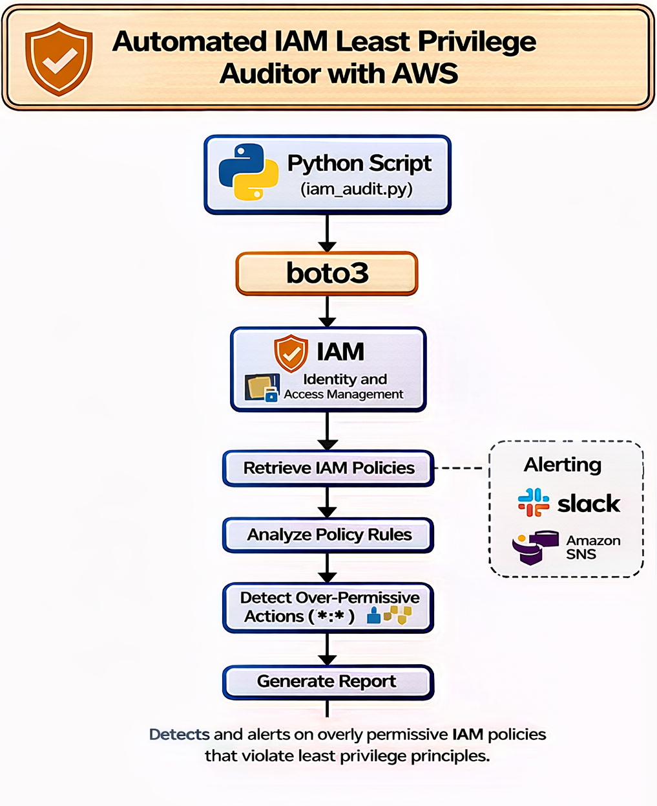

# Python Based Automated IAM Least-Privilege Auditor

### Purpose:
A python script that automatically detects IAM policies that violate least privilege principles.

### What it flags:

"Action": "*"

"Resource": "*"

### Usage:

python3 iam_audit.py

### Architecture Diagram

